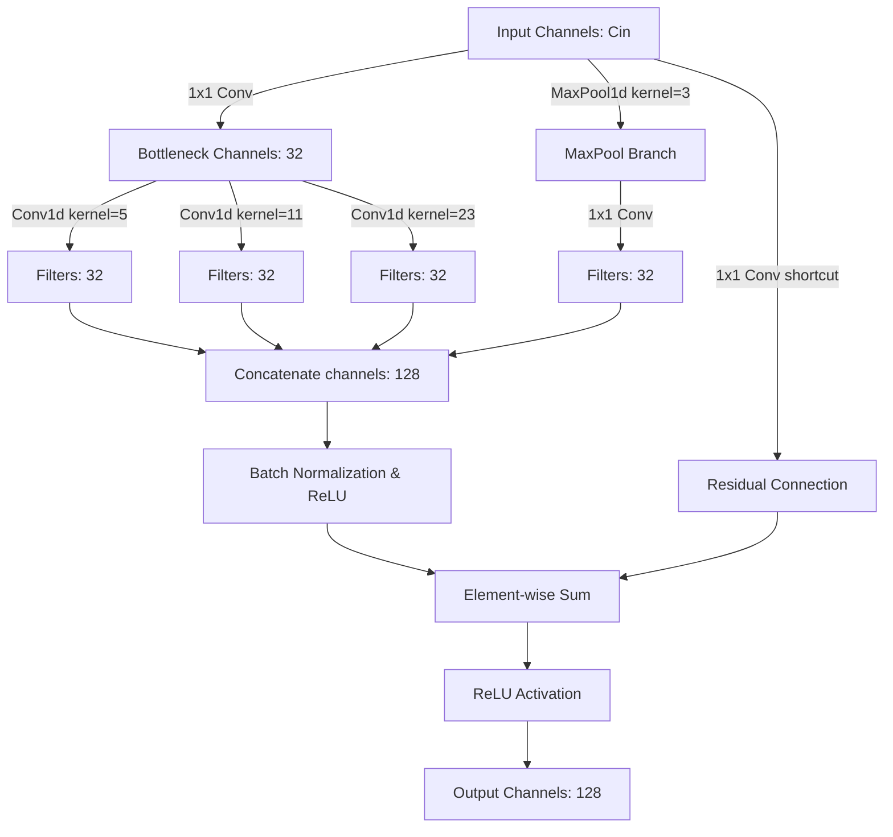
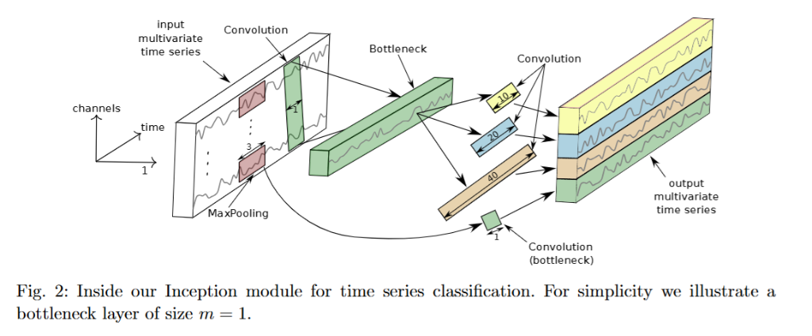
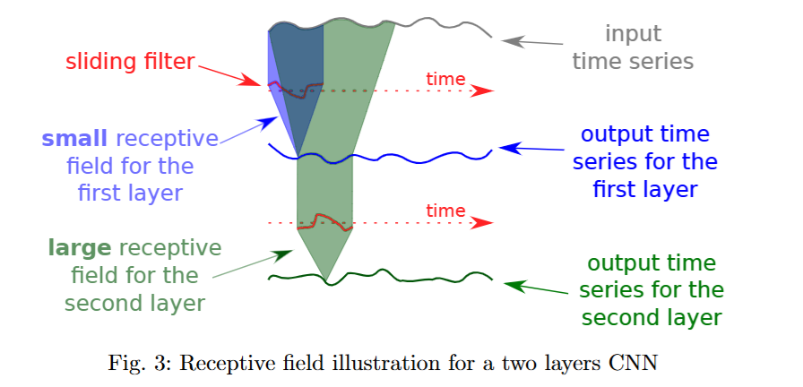
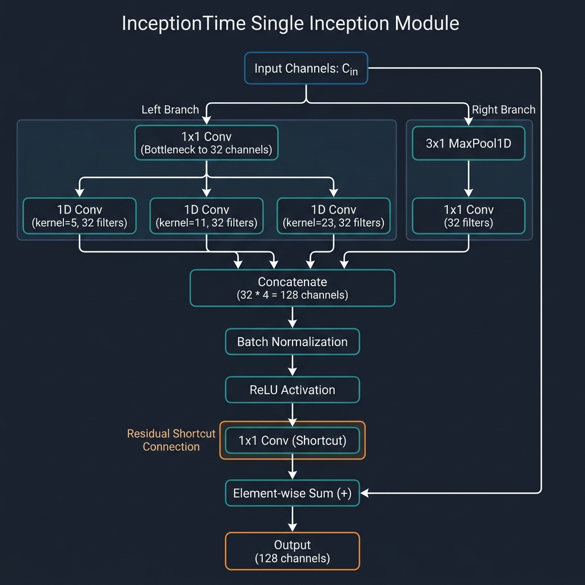
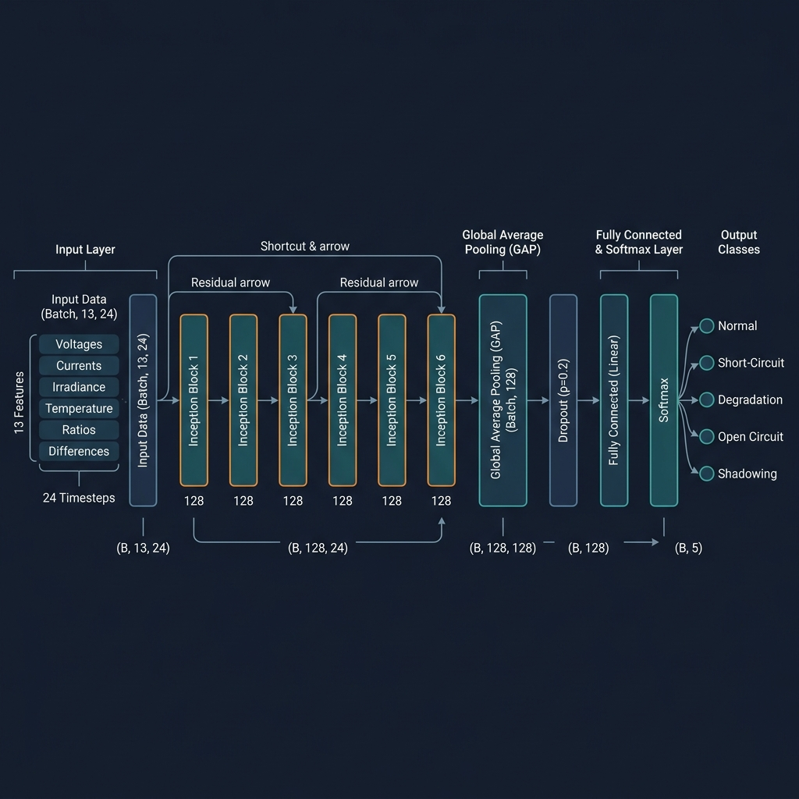

# EnergiaMind — AI Model Architecture & Technical Specifications

This document provides a detailed technical overview of the deep learning model, feature engineering pipeline, training hyperparameters, and architecture diagram used for fault detection in the EnergiaMind solar PV management system.

---

## 1. InceptionTime Model Overview

EnergiaMind utilizes the **InceptionTime** architecture (Fawaz et al., 2020) for multivariate solar PV time-series classification. InceptionTime was selected to replace standard LSTM layers due to its:
* **High Efficiency:** 1D convolutions can be parallelized natively on GPU, resulting in 3x–5x faster training than LSTMs.
* **Multi-Scale Feature Extraction:** Parallel convolution kernels of different sizes (5, 11, 23) allow the model to capture temporal features across different scales.
* **Accuracy:** Reached **99.80% test accuracy** and a **0.9975 Macro F1 score** on the held-out 20% test set.

```
Input [B, 13, 24] ──► [ 6x Inception Blocks ] ──► GAP ──► Dropout(0.2) ──► Linear(5) ──► Output [B, 5]
                        (with residual skip connections)
```

---

## 2. Model Architecture Detail

The network consists of **6 stacked Inception modules**, ending with a Global Average Pooling (GAP) layer, a Dropout regularization layer, and a fully connected linear layer.

### 2.1 The Inception Module
Each of the 6 Inception modules performs a parallel branch convolution:

1. **Bottleneck Layer:** A $1 \times 1$ Conv1D layer that reduces input channel dimensionality to $32$ channels before feeding it into the large kernels, keeping computational costs low.
2. **Multi-Scale Convolutional Branch:** Parallel 1D convolutions with kernel sizes **5, 11, and 23** (padded to keep sequence length unchanged). Each branch outputs $32$ channels.
3. **MaxPool Branch:** A parallel branch consisting of a MaxPool1D (kernel=3, stride=1, padding=1) followed by a $1 \times 1$ Conv1D layer (outputting $32$ channels) to capture prominent raw features.
4. **Concatenation & Normalization:** The outputs of the three multi-scale convolutions and the MaxPool branch are concatenated along the channel axis to produce $128$ channels ($32 \times 4$). This is followed by **Batch Normalization** and a **ReLU** activation.
5. **Residual Skip Connection:** A residual shortcut maps the block input to the output. An identity mapping or a $1 \times 1$ Conv1D matching layer is added to the block output, followed by a final **ReLU** activation. (No residual connection is applied to the very first block).



Here is the structural schematic of the Inception module from the official paper:



---


## 3. Preprocessing & Feature Engineering Pipeline

The model receives a sliding window of **24 timesteps** (equivalent to 12 minutes of operations at 30-second resolution) containing **13 features**.

### 3.1 Feature Columns (13 total)
* **Raw Measurements (6):**
  * `vdc1`: DC Voltage String 1
  * `vdc2`: DC Voltage String 2
  * `idc1`: DC Current String 1
  * `idc2`: DC Current String 2
  * `irr`: Solar Irradiance ($W/m^2$)
  * `pvt`: PV Panel Temperature (°C)
* **Derived Power Features (3):**
  * `pdc1`: DC Power String 1 ($vdc1 \times idc1$)
  * `pdc2`: DC Power String 2 ($vdc2 \times idc2$)
  * `pdcTotal`: Total DC Power ($pdc1 + pdc2$)
* **Ratio & Difference Features (4):**
  * `vdc_ratio`: $vdc1 / vdc2$ (Clamped to $[0.0, 5.0]$)
  * `idc_ratio`: $idc1 / idc2$ (Clamped to $[0.0, 5.0]$)
  * `vdc_diff`: $|vdc1 - vdc2|$
  * `idc_diff`: $|idc1 - idc2|$

### 3.2 Normalization & Warm-up
* **MinMax Normalization:** All 13 features are scaled to $[0, 1]$ using parameter ranges computed **only on the training set** to prevent data leakage.
* **Warm-up sliding window:** At startup, the model requires 24 sequential data points before it can perform its first prediction. The system reports `Normal operation (AI warming up)` for the first 23 ticks.

Here is the visualization of the 1D receptive field convolution over time:




---

## 4. Hyperparameters & Training Specifications

* **Optimization:** Adam optimizer with a learning rate of $1e-3$.
* **Epochs:** Trained for a maximum of 50 epochs with an early stopping patience of 10.
* **Batch Size:** 1024 samples.
* **Loss Function:** **Focal Loss** ($\gamma=2.0$) with class-balanced weighting $\alpha$ to counter class imbalance (85% of the dataset is Normal).
* **Train/Val/Test Split:** Stratified split by contiguous fault blocks:
  * **Train Set:** Days 1–12 (70% of dataset blocks)
  * **Validation Set:** Days 13–14 (10% of dataset blocks)
  * **Test Set:** Days 15–16 (20% of dataset blocks, exported as `simulation.csv`)

### 4.1 Fault Taxonomy (5 Classes)
* **Label 0: Normal** (Standard operations)
* **Label 1: Short-Circuit** (Critical safety hazard)
* **Label 2: Degradation** (Gradual performance loss)
* **Label 3: Open Circuit** (Zero current / broken connector)
* **Label 4: Shadowing** (Partial physical obstruction)

---

## 5. Architectural Diagram

Below is the scientific model architecture diagram detailing the layer connections and data dimensions:



And here is the high-level representation:



