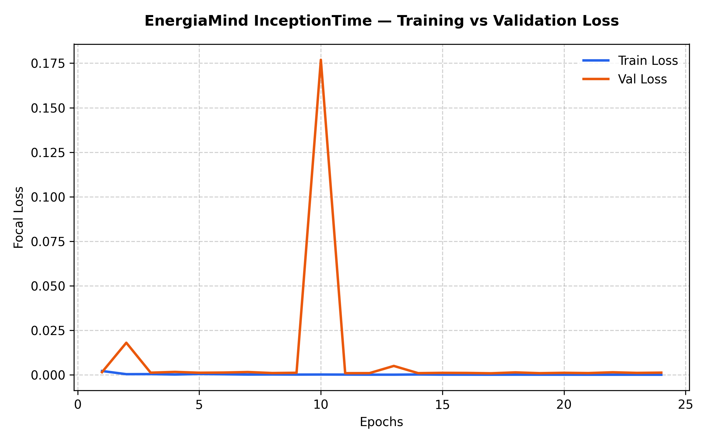
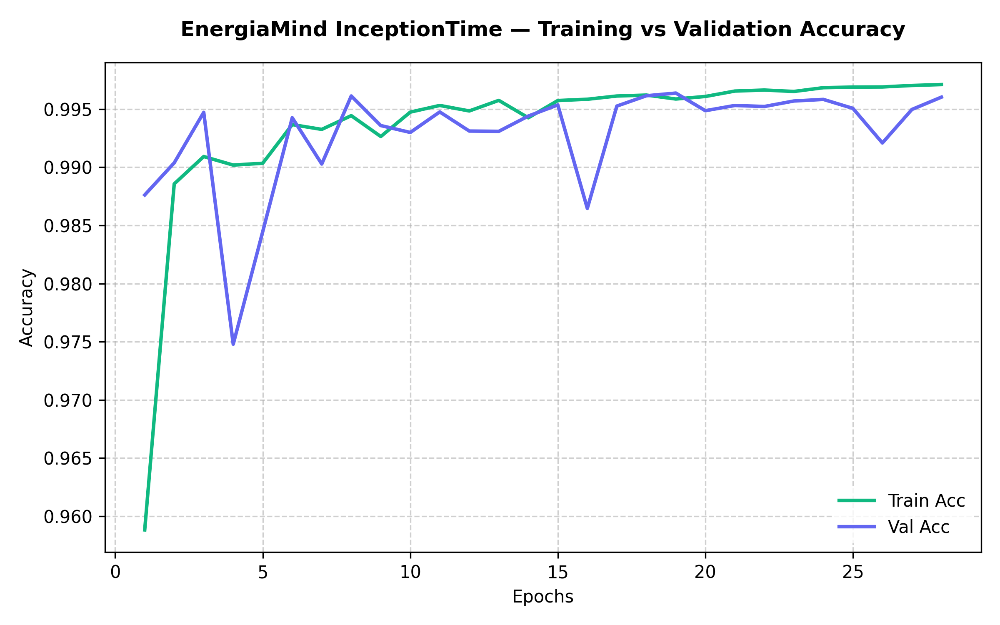
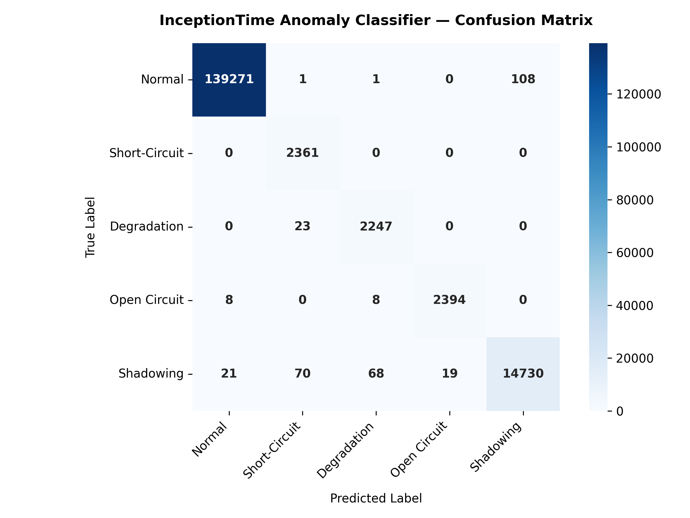

# EnergiaMind

<p align="center">
  
</p>

<p align="center">
  <strong>An Enterprise-Grade Solar PV Telemetry Monitoring & AI Anomaly Detection Platform</strong>
</p>

<p align="center">
  
  
  
  
  <br>
  
  
  
  
</p>

---

## 1. Authors & Academic Affiliation

*   **Authors:**
    1.  **Lê Trí Dũng** (MSSV: 202414985)
    2.  **Trương Quang Khánh** (MSSV: 202415008)
    3.  **Lê Trung Kiên** (MSSV: 202415015)
*   **Affiliation:** School of Electrical and Electronic Engineering, Hanoi University of Science and Technology (HUST)
*   **Course:** Applied Software Engineering (Kỹ thuật Phần mềm Ứng dụng - ET3260Q), Class 166324
*   **Instructor:** PGS. TS. Vũ Hải
*   **Copyright:** © 2026. All rights reserved.
*   **Citation Requirement:** If you utilize this codebase, the trained model weights, or the system architecture for academic research, graduation theses, papers, or coursework, you must cite this repository:
    ```bibtex
    @misc{energiamind2026solar,
      author       = {Le Tri Dung and Truong Quang Khanh and Le Trung Kien},
      title        = {Web-based Real-time Monitoring, Fault Detection and Classification for Solar PV Systems using Convolutional Neural Networks},
      year         = {2026},
      publisher    = {GitHub},
      journal      = {GitHub Repository},
      howpublished = {\url{https://github.com/dunglt69/solar-anomaly-detection}}
    }
    ```

---

## 2. Academic Disclaimer
**EnergiaMind is a fictional platform** designed and developed strictly for academic research, university thesis presentation, and technical demonstration. It does not correspond to a real commercial product, registered trademark, or operational company. All branding assets, mock company names, and data streams are created for simulation scenarios.

---

## 3. Core Features & System Capabilities

*   **ISA-101 HMI Dashboard**: Designed according to ISA-101 standards, featuring a gray-scale normal state to minimize operator fatigue, highlighting anomalies in vibrant, high-contrast colors only when faults are detected.
*   **AI-Powered Fault Detection Pipeline**: Operates a **pure, sequence-based AI-only classification pipeline** leveraging an **InceptionTime** model:
    *   *Telemetry Preprocessing*: Automatically ingests raw electrical and environmental telemetry (DC Voltage, DC Current, Solar Irradiance, Panel Temperature).
    *   *13-Feature Engineering*: Computes derived power values ($P_{dc1}, P_{dc2}, P_{total}$) and relative ratios/differences on raw values ($V_{ratio}, I_{ratio}, V_{diff}, I_{diff}$) to detect string-to-string mismatches.
    *   *InceptionTime Classifier*: A 6-layer 1D convolutional neural network (CNN) executed via `onnxruntime-node` utilizing its native C++ asynchronous thread pool to offload matrix computations and prevent blocking the Node.js main thread event loop.
    *   *Confidence-Gated Taxonomy*: Directly outputs a 5-class classification: **Normal (0), Short-Circuit (1), Degradation (2), Open Circuit (3), Shadowing (4)**. Uses a deterministic confidence threshold guardrail (confidence > 0.70) on the AI's predictions to eliminate false positives.
*   **Dynamic Server-Side Downsampling**: The backend dynamically downsamples telemetry queries using modulo-based row sampling when the result set exceeds 15,000 rows, achieving up to 300× query speedup while preserving statistical accuracy for chart rendering on Apache ECharts.
*   **Browser-Based Device Binding (1:1)**: Staff accounts are bound to a structured hardware fingerprint computed from high-entropy browser characteristics (WebGL renderer, CPU cores, RAM, screen resolution, timezone, color depth, and touch points) collected on first login and stored server-side for subsequent verification.
*   **Automated Incident Ticketing**: When the AI pipeline classifies a string fault, it immediately generates a database-tracked Alert, creates a Support Ticket, and broadcasts the event payload live to active browsers over WebSockets.

---

## 4. Repository Structure & Architecture

### 4.1 Directory Structure
```
.
├── client/                     # Vite + React 19 Frontend
│   ├── src/
│   │   ├── components/         # Reusable UI elements (Charts, KPICards, Layout)
│   │   ├── pages/              # Routing pages (Dashboard, Alerts, Admin, Settings)
│   │   ├── stores/             # Zustand state stores (authStore, alertStore)
│   │   └── styles/             # CSS design tokens & global layout variables
│   └── package.json
├── server/                     # Fastify 5 Backend
│   ├── src/
│   │   ├── db/                 # Drizzle Schema, Migrations, Seed script
│   │   ├── routes/             # REST endpoints (auth, telemetry, alerts)
│   │   ├── services/           # Core business logic (ai, alert, modbus, telemetry)
│   │   └── tests/              # 943 Vitest unit & integration test cases
│   ├── models/                 # Pre-trained ONNX model files & metadata
│   └── package.json
├── tools/                      # AI training & data engineering script files
│   ├── prepare_dataset.py      # Cleans, extracts features, and splits dataset
│   ├── train_inception.py      # Trains PyTorch InceptionTime with Focal Loss
│   ├── export_onnx.py          # Exports PyTorch checkpoint to ONNX format
│   ├── simulator-modbus.ts     # Asynchronous Modbus TCP Slave device simulator
│   └── data/                   # Target folder for binary .npy datasets (git ignored)
└── cloudflared-config.example.yml  # Template for Cloudflare Tunnel staging
```

### 4.2 System Topology
```
[PV Array & Inverter] 
       │ (Modbus TCP / RTU Protocol - Registers 40001-40006)
       ▼
[Web Backend (Fastify 5 Server)] ──(ONNX Runtime)──► [InceptionTime Classifier]
       │                                                      │
       ├──(Drizzle ORM)──► [SQLite DB]                        │
       │                                                      ▼ (Alerts / Telemetry)
       └──(Secure WebSockets - Subprotocol JWT)────────► [Web Frontend (React 19 Client)]
```

---

## 5. Detailed Installation & Setup Guide

### 5.1 System Prerequisites
Ensure the following software is installed before starting setup:
1.  **Node.js**: Version `18.0.0` or newer.
2.  **npm**: Version `9.0.0` or newer.
3.  **Python** *(Optional, for AI retraining)*: Version `3.9` or newer (along with `pip` and `virtualenv`).
4.  **Git**: For repository cloning and tag verification.

---

<details>
<summary><b>🛠️ Step 1: Environment Variables Configuration</b></summary>

Create a `.env` file in the `server/` directory:
```ini
PORT=3000
JWT_SECRET=your_super_secure_jwt_signing_secret_at_least_32_chars
TURNSTILE_SECRET_KEY=1x0000000000000000000000000000000AA # Dev dummy key
MODBUS_ENABLED=1
MODBUS_HOST=127.0.0.1
MODBUS_PORT=5020
MODBUS_POLL_MS=5000
```
*Note: `JWT_SECRET` must be at least 32 characters long. If missing or too short, the Fastify server will output a warning at startup.*

Create a `.env` file in the `client/` directory:
```ini
VITE_API_URL=http://localhost:3000
VITE_WS_URL=ws://localhost:3000
VITE_TURNSTILE_SITE_KEY=1x0000000000000000000000000000000AA # Dev dummy key
```
</details>

<details>
<summary><b>📦 Monorepo Workspace Installation (Quick Start)</b></summary>

EnergiaMind is structured as an npm Workspace. You can install all dependencies for both the client and server at once from the root directory:
```bash
# 1. Install all dependencies across the monorepo
npm run bootstrap

# 2. Run both the backend and frontend in development mode simultaneously (in separate shells)
npm run dev:server
npm run dev:client
```
</details>

<details>
<summary><b>📦 Step 2: Web Backend Setup (Fastify 5)</b></summary>

1.  Navigate to the server directory:
    ```bash
    cd server
    ```
2.  Install dependencies:
    ```bash
    npm install
    ```
3.  Apply database migrations and seed default administrative accounts:
    ```bash
    npm run db:migrate && npm run db:seed
    ```
    *   *Default Admin Credentials:* Username: `admin` / Password: `Admin@123`
    *   *What this does:* Executes Drizzle ORM compiled migration files sequentially to guarantee schema integrity, then seeds the default configurations and the initial Admin user.
4.  Run the backend server in development mode:
    ```bash
    npm run dev
    ```
</details>

<details>
<summary><b>🖥️ Step 3: Web Frontend Setup (Vite + React 19)</b></summary>

1.  Navigate to the client directory:
    ```bash
    cd client
    ```
2.  Install dependencies:
    ```bash
    npm install
    ```
3.  Start the local development server:
    ```bash
    npm run dev
    ```
4.  Open your browser and navigate to `http://localhost:5173`.
</details>

<details>
<summary><b>⚡ Step 4: Running the Modbus Device Simulator</b></summary>

To test the real-time Modbus telemetry polling loop and AI classification:
1.  Launch the Modbus TCP Slave device simulator in a separate terminal:
    ```bash
    npx tsx tools/simulator-modbus.ts --fast
    ```
    *   This starts a Modbus TCP server on `127.0.0.1:5020`.
    *   It streams unscaled physical data from `simulation.csv` to holding registers.
    *   It simulates a 2% network packet drop or Modbus Exception Responses (e.g., Code 0x04 - Slave Device Failure) to validate system resilience.
2.  The backend will automatically start polling the registers, run ONNX AI inference on the sliding window, write records to the SQLite database, and broadcast data to the React client over WebSockets.
</details>

<details>
<summary><b>🌐 Step 5: Secure Cloudflare Tunnel Setup (CV Showcase & Demos)</b></summary>

If you want to share a live showcase of this application securely with teachers or interviewers without exposing ports on your router, follow this guide:
1.  Install the Cloudflare Tunnel client (`cloudflared`) on your machine.
2.  Login and authenticate:
    ```bash
    cloudflared tunnel login
    ```
3.  Create your tunnel:
    ```bash
    cloudflared tunnel create energiamind-tunnel
    ```
4.  Copy the configuration template:
    ```bash
    cp cloudflared-config.example.yml config.yml
    ```
5.  Edit `config.yml` with your Tunnel UUID, local paths, and target domain name.
6.  Route your DNS to the tunnel:
    ```bash
    cloudflared tunnel route dns energiamind-tunnel energiamind.yourdomain.com
    ```
7.  Run the tunnel:
    ```bash
    cloudflared tunnel --config config.yml run energiamind-tunnel
    ```
*Note: Committing `config.yml` (without your credentials `.json` file containing keys) to Git is entirely safe and demonstrates excellent cloud engineering skills on a CV.*
</details>

<details>
<summary><b>🧪 Step 6: Running the Test Suite</b></summary>

To verify system integrity and execution safety before deployment, run the automated test matrix (893 test cases covering REST endpoints, WebSocket event propagation, and JWT state machines):
```bash
# Run tests directly via npm workspace
npm run test:server

# Or navigate to server directory
cd server
npm run test
```
*   *What this does:* Executes Vitest test suites in an isolated SQLite environment (`energiamind_test.db`) to ensure 100% logic and routing correctness.
</details>

<details>
<summary><b>🔍 Step 7: Troubleshooting, FAQ & API Reference</b></summary>

### 1. ONNX Runtime Library Compilation Errors
*   **Problem:** If you encounter error logs related to `onnxruntime-node` binary loading (e.g. `invalid ELF header`, `module not found`), it means the pre-built binary does not match your system architecture (Apple Silicon vs Intel/AMD).
*   **Solution:** Rebuild the package locally for your architecture:
    ```bash
    cd server
    npm rebuild onnxruntime-node
    ```

### 2. API Documentation
*   The Fastify API routing schema details can be inspected directly in the route declaration files under [server/src/routes](./server/src/routes).
*   Mock requests and endpoint payloads for Modbus or authentication are available in the load testing tool under [server/tools/load-test.ts](./server/tools/load-test.ts).
</details>

---

## 6. AI Toolchain & Deep Learning Pipeline

The `tools/` directory contains the Python-based data engineering and machine learning code used to train and compile the model.

### 6.1 Setup Python Environment
1.  Navigate to the root of the workspace and create a virtual environment:
    ```bash
    python -m venv .venv
    ```
2.  Activate the virtual environment:
    *   *Windows (CMD/PowerShell)*: `.venv\Scripts\activate`
    *   *macOS/Linux*: `source .venv/bin/activate`
3.  Install dependencies:
    ```bash
    pip install pandas numpy torch scikit-learn tqdm onnx
    ```

### 6.2 Training Workflow
1.  **Prepare Dataset**: Place the raw dataset `pv_fault_dataset.csv` inside `pv_fault_dataset-master/` and run:
    ```bash
    python tools/prepare_dataset.py
    ```
    *   *Action*: Calculates power and ratio features on raw data, performs MinMax scaling, splits the dataset chronologically by contiguous blocks (70% Train, 10% Val, 20% Test) to prevent temporal data leakage, and outputs binary numpy arrays (`.npy`) under `tools/data/`.
2.  **Train InceptionTime**: Train the deep learning model:
    ```bash
    python tools/train_inception.py
    ```
    *   *Action*: Trains InceptionTime (depth=6, filters=32) using PyTorch with Focal Loss ($\gamma=2.0$) to counter severe class imbalance. Achieves a test accuracy of **99.80%** and saves checkpoints to `server/models/inception_checkpoint.pt`.
3.  **Export to ONNX**: Convert the PyTorch checkpoint to ONNX:
    ```bash
    python tools/export_onnx.py
    ```
    *   *Action*: Compiles the checkpoint into `inception_fault_classifier.onnx` and outputs `model_metadata.json` (class names and model config) and `scaler_params.json` (MinMaxScaler ranges for inference normalization).

### 6.3 AI Model Performance Metrics

The pre-trained InceptionTime model achieves a test accuracy of **99.80%** on the held-out test set (Days 15–16). Below is the comprehensive classification report containing **Micro (Accuracy), Macro, and Weighted** averages across all classes, along with per-class metrics:

| Metric | Precision | Recall | F1-Score | Support |
| :--- | :---: | :---: | :---: | :---: |
| **Normal** | 1.0000 | 1.0000 | 1.0000 | 139,381 |
| **Short-Circuit** | 0.9512 | 1.0000 | 0.9750 | 2,361 |
| **Degradation** | 0.9631 | 0.9899 | 0.9763 | 2,270 |
| **Open Circuit** | 0.9946 | 0.9938 | 0.9942 | 2,410 |
| **Shadowing** | 0.9940 | 0.9854 | 0.9897 | 14,908 |
| **Micro Average (Accuracy)** | **0.9980** | **0.9980** | **0.9980** | **161,330** |
| **Macro Average** | **0.9806** | **0.9938** | **0.9870** | **161,330** |
| **Weighted Average** | **0.9978** | **0.9978** | **0.9978** | **161,330** |

---

### 6.4 Training & Validation Visualization

During the training phase (early stopped at epoch 24), the metrics and confusion matrix were generated and plotted:

#### 1. Training vs Validation Loss Curve
Shows how Focal Loss ($\gamma=2.0$) decreases smoothly and stabilizes for both training and validation sets, proving zero overfitting:

<p align="center">
  
</p>

#### 2. Training vs Validation Accuracy Curve
Shows the model's rapid learning rate, reaching above 99% accuracy in under 10 epochs:

<p align="center">
  
</p>

#### 3. Classification Confusion Matrix Heatmap
Visualizes the exact distribution of true versus predicted labels, highlighting the extremely low false positive and false negative counts even for highly-imbalanced classes like Short-Circuit and Degradation:

<p align="center">
  
</p>

---

## 7. Security Controls & Performance Characteristics

### 7.1 Login Latency (Argon2id Hashing)
When logging into the platform, operators will notice a delay of **1 to 3 seconds** before receiving confirmation. **This is a deliberate security design choice, not a performance bug:**
*   **Argon2id Hashing**: Password validation uses the OWASP-recommended **Argon2id** password hashing algorithm (parameters: memoryCost=19456 KB, timeCost=2, parallelism=1). This is CPU and memory-hard, specifically designed to make brute-force attacks via high-performance GPUs economically unfeasible.
*   **Timing Attack Mitigation**: To defend against username enumeration, if a login attempt is made for a non-existent username, the backend runs a dummy Argon2id hashing process of equal cost. This guarantees that requests for valid and invalid usernames take the exact same amount of time, preventing attackers from identifying registered accounts using timing analysis.

### 7.2 Release Procedures & Integrity Checks
For production deployments, release assets are distributed through compiled artifacts to ensure source code and model weights are not tampered with.

#### GPG Commit and Tag Signing
To guarantee author identity and prevent man-in-the-middle repository modifications, all commits and tags must be signed using a **GPG key**:
*   Sign a commit:
    ```bash
    git commit -S -m "release: compile production release v1.0.0"
    ```
*   Sign a tag:
    ```bash
    git tag -s v1.0.0 -m "Release version 1.0.0"
    ```
*   Verify signatures:
    ```bash
    git log --show-signature -n 1
    ```

#### Integrity Checksums (SHA-256)
When exporting release zip packages or updating the `.onnx` model file in production, generate and verify the SHA-256 checksums to ensure file integrity.
*   **Windows (PowerShell)**:
    ```powershell
    CertUtil -hashfile server/models/inception_fault_classifier.onnx SHA256
    ```
*   **macOS/Linux**:
    ```bash
    sha256sum server/models/inception_fault_classifier.onnx
    ```
Compare the output string against the official release metadata sheet to verify that the model has not been altered or corrupted during transfer.

---

## 8. Scientific References & Citations

### 8.1 Photovoltaic Plant Fault Dataset
*   **Citation:** A. E. Lazzaretti et al., *"A Monitoring System for Online Fault Detection and Classification in Photovoltaic Plants,"* Sensors, vol. 20, no. 17, p. 4688, Aug. 2020, doi: [10.3390/s20174688](https://doi.org/10.3390/s20174688).
*   **Context:** Provides the raw 16-day electrical and environmental sensor measurements collected from a grid-tie solar PV plant used to train the EnergiaMind neural network.

### 8.2 Time-Series Deep Learning (InceptionTime)
*   **Citation:** H. I. Fawaz et al., *"InceptionTime: Finding AlexNet for Time Series Classification,"* Data Mining and Knowledge Discovery, vol. 34, no. 6, pp. 1936–1962, 2020, doi: [10.1007/s10618-020-00710-y](https://doi.org/10.1007/s10618-020-00710-y).
*   **Context:** Outlines the parallel multi-scale 1D convolution architecture used to build the deep learning model.

### 8.3 Largest-Triangle-Three-Buckets (LTTB) Downsampling
*   **Citation:** S. Steinarsson, *"Downsampling Time Series for Visual Representation,"* Master's Thesis, School of Engineering and Natural Sciences, University of Iceland, Reykjavik, Iceland, 2013. [Thesis Link](https://skemman.is/handle/1946/15343).
*   **Context:** Establishes the downsampling algorithm used to compress telemetry points on frontend charts.

---

## 9. License & Usage Conditions

This project is licensed under the **Apache License 2.0**.

### License & Compliance Terms:
1.  **Grant of Rights**: You are free to use, reproduce, modify, and distribute this software for personal, academic, or commercial purposes, subject to the conditions of the Apache License 2.0.
2.  **Liability & Warranty**: The software is provided "AS IS", without warranties or conditions of any kind, either express or implied, as defined in Section 7 of the Apache License.
3.  **Academic Integrity & Attribution**: If you copy, modify, or adapt this project for academic evaluations, university graduation theses, coursework, or research papers, you must clearly cite the author (Le Tri Dung) and HUST School of Electrical and Electronic Engineering. Failing to do so constitutes plagiarism and a violation of HUST academic integrity guidelines.
