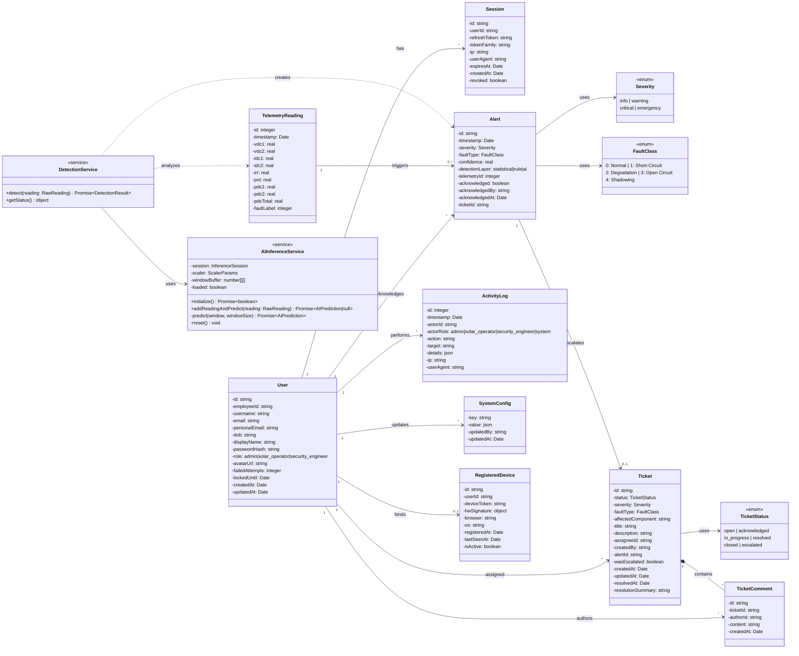

# Class Diagram — EnergiaMind Domain Model

> Core Entities, Enums, and Relationships

```mermaid
classDiagram
    direction LR

    class Severity {
        <<enum>>
        info | warning
        critical | emergency
    }

    class FaultClass {
        <<enum>>
        0: Normal | 1: Short-Circuit
        2: Degradation | 3: Open Circuit
        4: Shadowing
    }

    class TicketStatus {
        <<enum>>
        open | acknowledged
        in_progress | resolved
        closed | escalated
    }

    class User {
        -id: string
        -employeeId: string
        -username: string
        -email: string
        -personalEmail: string
        -dob: string
        -displayName: string
        -passwordHash: string
        -role: admin|solar_operator|security_engineer
        -avatarUrl: string
        -failedAttempts: integer
        -lockedUntil: Date
        -createdAt: Date
        -updatedAt: Date
    }

    class Session {
        -id: string
        -userId: string
        -refreshToken: string
        -tokenFamily: string
        -ip: string
        -userAgent: string
        -expiresAt: Date
        -createdAt: Date
        -revoked: boolean
    }

    class TelemetryReading {
        -id: integer
        -timestamp: Date
        -vdc1: real
        -vdc2: real
        -idc1: real
        -idc2: real
        -irr: real
        -pvt: real
        -pdc1: real
        -pdc2: real
        -pdcTotal: real
        -faultLabel: integer
    }

    class AIInferenceService {
        <<service>>
        -session: InferenceSession
        -scaler: ScalerParams
        -windowBuffer: number[][]
        -loaded: boolean
        +initialize() Promise~boolean~
        +addReadingAndPredict(reading: RawReading) Promise~AIPrediction|null~
        -predict(window, windowSize) Promise~AIPrediction~
        +reset() void
    }

    class DetectionService {
        <<service>>
        +detect(reading: RawReading) Promise~DetectionResult~
        +getStatus() object
    }

    class Alert {
        -id: string
        -timestamp: Date
        -severity: Severity
        -faultType: FaultClass
        -confidence: real
        -detectionLayer: statistical|rule|ai
        -telemetryId: integer
        -acknowledged: boolean
        -acknowledgedBy: string
        -acknowledgedAt: Date
        -ticketId: string
    }

    class Ticket {
        -id: string
        -status: TicketStatus
        -severity: Severity
        -faultType: FaultClass
        -affectedComponent: string
        -title: string
        -description: string
        -assigneeId: string
        -createdBy: string
        -alertId: string
        -wasEscalated: boolean
        -createdAt: Date
        -updatedAt: Date
        -resolvedAt: Date
        -resolutionSummary: string
    }

    class TicketComment {
        -id: string
        -ticketId: string
        -authorId: string
        -content: string
        -createdAt: Date
    }

    class ActivityLog {
        -id: integer
        -timestamp: Date
        -actorId: string
        -actorRole: admin|solar_operator|security_engineer|system
        -action: string
        -target: string
        -details: json
        -ip: string
        -userAgent: string
    }

    class SystemConfig {
        -key: string
        -value: json
        -updatedBy: string
        -updatedAt: Date
    }

    class RegisteredDevice {
        -id: string
        -userId: string
        -deviceToken: string
        -hwSignature: object
        -browser: string
        -os: string
        -registeredAt: Date
        -lastSeenAt: Date
        -isActive: boolean
    }

    User "1" --> "*" Session : has
    User "1" --> "*" Ticket : assigned
    User "1" --> "*" TicketComment : authors
    User "1" --> "*" ActivityLog : performs
    User "1" --> "*" Alert : acknowledges
    User "1" --> "*" SystemConfig : updates
    User "1" --> "0..1" RegisteredDevice : binds

    TelemetryReading "1" --> "0..*" Alert : triggers
    DetectionService ..> TelemetryReading : analyzes
    DetectionService ..> Alert : creates
    DetectionService --> AIInferenceService : uses

    Alert "1" --> "0..1" Ticket : escalates
    Ticket "1" *-- "*" TicketComment : contains

    Alert --> Severity : uses
    Alert --> FaultClass : uses
    Ticket --> TicketStatus : uses
```,StartLine:29,TargetContent:
```
