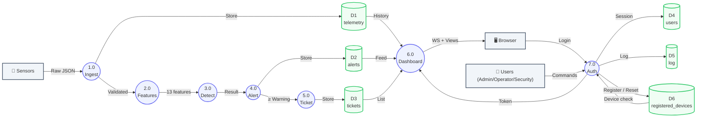

# Data Flow Diagram — EnergiaMind Platform

> Level 0 (Context) + Level 1 (Decomposition) — Merged

```mermaid
flowchart LR
  %% External Entities
  SENSOR["📡 Sensors"]:::ext
  BROWSER["🖥️ Browser"]:::ext
  USER["👤 Users (Admin/Operator/Security)"]:::ext

  %% Level 1 Processes
  P1(("1.0\nIngest")):::proc
  P2(("2.0\nFeatures")):::proc
  P3(("3.0\nDetect")):::proc
  P4(("4.0\nAlert")):::proc
  P5(("5.0\nTicket")):::proc
  P6(("6.0\nDashboard")):::proc
  P7(("7.0\nAuth")):::proc

  %% Data Stores
  D1[("D1\ntelemetry")]:::store
  D2[("D2\nalerts")]:::store
  D3[("D3\ntickets")]:::store
  D4[("D4\nusers")]:::store
  D5[("D5\nlog")]:::store
  D6[("D6\nregistered_devices")]:::store

  %% Main pipeline
  SENSOR -->|"Raw JSON"| P1
  P1 -->|"Validated"| P2
  P2 -->|"13 features"| P3
  P3 -->|"Result"| P4
  P4 -->|"≥ Warning"| P5

  %% Stores
  P1 -->|"Store"| D1
  P4 -->|"Store"| D2
  P5 -->|"Store"| D3
  D6 -->|"Device check"| P7

  %% Dashboard reads
  D1 -->|"History"| P6
  D2 -->|"Feed"| P6
  D3 -->|"List"| P6

  %% Output
  P6 -->|"WS + Views"| BROWSER

  %% Auth & Admin
  BROWSER -->|"Login"| P7
  USER -->|"Commands"| P7
  P7 -->|"Token"| P6
  P7 -->|"Session"| D4
  P7 -->|"Log"| D5
  P7 -->|"Register / Reset"| D6

  classDef ext fill:#F1F5F9,stroke:#475569,stroke-width:2px
  classDef proc fill:#EEF2FF,stroke:#6366F1,stroke-width:2px
  classDef store fill:#F0FDF4,stroke:#22C55E,stroke-width:2px
```
