# Functional Hierarchy — EnergiaMind Platform

> Biểu đồ phân cấp chức năng — 3-Level Decomposition

```mermaid
graph TD
  ROOT["EnergiaMind Platform\nSolar Monitoring System"]:::l0

  ROOT --> M1 & M2 & M3 & M4 & M5

  M1["1. Authentication\n& Access Control"]:::l1
  M2["2. Monitoring\nReal-Time Telemetry"]:::l1
  M3["3. AI Detection\nAnomaly Diagnosis"]:::l1
  M4["4. Alerting & Ticketing\nIncident Response"]:::l1
  M5["5. Administration\nSystem Management"]:::l1

  M1 --> M1A["Login / Logout"]:::l2
  M1 --> M1B["JWT Rotation"]:::l2
  M1 --> M1C["RBAC Middleware"]:::l2

  M2 --> M2A["Live Dashboard"]:::l2
  M2 --> M2B["KPI Cards"]:::l2
  M2 --> M2C["Time-Series Charts"]:::l2
  M2 --> M2D["Dynamic Downsampling"]:::l2

  M3 --> M3A["Sliding Window Buffer\n24-Step Sequence Buffer"]:::l2
  M3 --> M3B["InceptionTime ONNX\nAI Model Inference"]:::l2
  M3 --> M3C["Softmax Classifier\n5-Class Fault Classifier"]:::l2

  M4 --> M4A["Generate Alert & Ticket"]:::l2
  M4 --> M4B["WS Broadcast"]:::l2
  M4 --> M4C["Alert Detail Modal\n(Unified Notes & Action Flow)"]:::l2
  M4 --> M4D["State Machine\n(Status Flow)"]:::l2

  M5 --> M5A["User Management"]:::l2
  M5 --> M5B["Activity Log"]:::l2
  M5 --> M5C["System Settings"]:::l2
  M5 --> M5D["Database Schema\nERD Diagram"]:::l2

  M1A --> M1A1["Validate Credentials"]:::l3
  M1A --> M1A2["Account Lockout"]:::l3
  M1A --> M1A3["Device Binding Check"]:::l3
  M2A --> M2A1["WebSocket Stream"]:::l3
  M2A --> M2A2["REST Query"]:::l3
  M3C --> M3C1["5-Class Classify"]:::l3
  M3C --> M3C2["Confidence Score"]:::l3
  M4D --> M4D1["Status Transition\n(Acknowledge/Resolve/Escalate)"]:::l3
  M4D --> M4D2["TTA / TTR Metrics"]:::l3
  M5A --> M5A1["Profile Management\n(DOB/Emails)"]:::l3
  M5A --> M5A2["Unlock Account"]:::l3
  M5A --> M5A3["Reset Device Binding"]:::l3

  classDef l0 fill:#0F172A,stroke:#0F172A,color:white,font-weight:bold
  classDef l1 fill:#4338CA,stroke:#4338CA,color:white,font-weight:bold
  classDef l2 fill:#E0E7FF,stroke:#6366F1,stroke-width:1.5px,color:#1E293B
  classDef l3 fill:#F8FAFC,stroke:#CBD5E1,stroke-width:1px,color:#334155
```

## Module Summary

| Level | Count | Examples |
|---|---|---|
| **L0 — System** | 1 | EnergiaMind Platform |
| **L1 — Modules** | 5 | Auth, Monitoring, AI, Alerting & Ticketing, Admin |
| **L2 — Sub-functions** | 19 | Login, KPI Cards, ONNX Inference, WS Broadcast, State Machine, Dynamic Downsampling |
| **L3 — Leaf Operations** | 12 | Validate Credentials, Device Binding Check, Unlock Account, Reset Device Binding |
