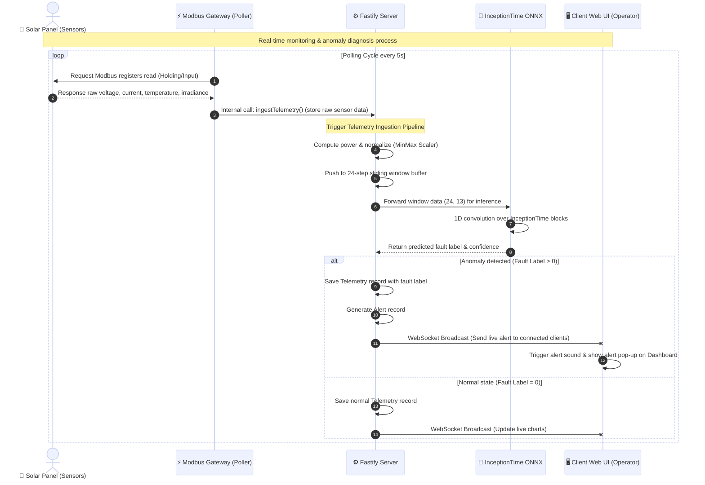

# 6_swimlane_diagram

```mermaid
%%{init: {'theme': 'base', 'themeVariables': { 'primaryColor': '#EEF2FF', 'edgeLabelBackground':'#FFFFFF'}}}%%
sequenceDiagram
  autonumber
  actor Panel as 📡 Solar Panel (Sensors)
  participant Gateway as ⚡ Modbus Gateway (Poller)
  participant Backend as ⚙️ Fastify Server
  participant AI as 🧠 InceptionTime ONNX
  participant UI as 🖥️ Client Web UI (Operator)

  Note over Panel, UI: Real-time monitoring & anomaly diagnosis process
  
  loop Polling Cycle every 5s
      Gateway->>Panel: Request Modbus registers read (Holding/Input)
      Panel-->>Gateway: Response raw voltage, current, temperature, irradiance
      Gateway->>Backend: Internal call: ingestTelemetry() (store raw sensor data)
      Note over Backend: Trigger Telemetry Ingestion Pipeline
      Backend->>Backend: Compute power & normalize (MinMax Scaler)
      Backend->>Backend: Push to 24-step sliding window buffer
      Backend->>AI: Forward window data (24, 13) for inference
      AI->>AI: 1D convolution over InceptionTime blocks
      AI-->>Backend: Return predicted fault label & confidence
      
      alt Anomaly detected (Fault Label > 0)
          Backend->>Backend: Save Telemetry record with fault label
          Backend->>Backend: Generate Alert record
          Backend-xUI: WebSocket Broadcast (Send live alert to connected clients)
          UI->>UI: Trigger alert sound & show alert pop-up on Dashboard
      else Normal state (Fault Label = 0)
          Backend->>Backend: Save normal Telemetry record
          Backend-xUI: WebSocket Broadcast (Update live charts)
      end
  end
```
