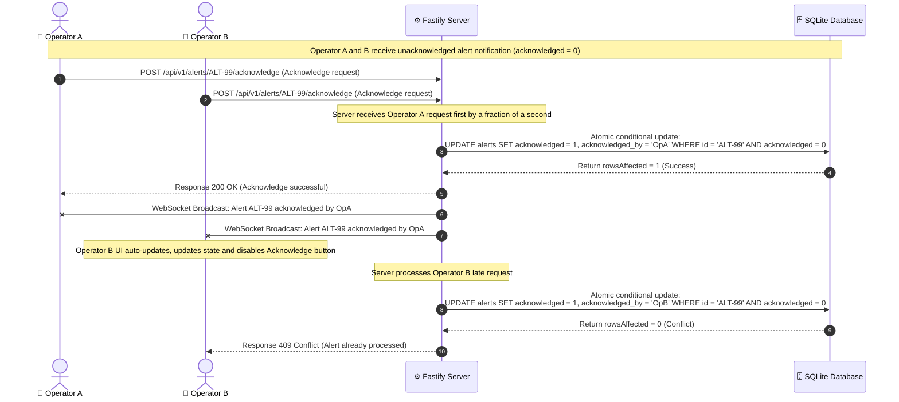

# 7_sequence_diagram

```mermaid
sequenceDiagram
  autonumber
  actor OpA as 👤 Operator A
  actor OpB as 👤 Operator B
  participant Server as ⚙️ Fastify Server
  participant DB as 🗄️ SQLite Database

  Note over OpA, DB: Operator A and B receive unacknowledged alert notification (acknowledged = 0)
  
  OpA->>Server: POST /api/v1/alerts/ALT-99/acknowledge (Acknowledge request)
  OpB->>Server: POST /api/v1/alerts/ALT-99/acknowledge (Acknowledge request)
  
  Note over Server: Server receives Operator A request first by a fraction of a second
  Server->>DB: Atomic conditional update:<br>UPDATE alerts SET acknowledged = 1, acknowledged_by = 'OpA' WHERE id = 'ALT-99' AND acknowledged = 0
  DB-->>Server: Return rowsAffected = 1 (Success)
  Server-->>OpA: Response 200 OK (Acknowledge successful)
  
  Server-xOpA: WebSocket Broadcast: Alert ALT-99 acknowledged by OpA
  Server-xOpB: WebSocket Broadcast: Alert ALT-99 acknowledged by OpA
  Note over OpB: Operator B UI auto-updates, updates state and disables Acknowledge button
  
  Note over Server: Server processes Operator B late request
  Server->>DB: Atomic conditional update:<br>UPDATE alerts SET acknowledged = 1, acknowledged_by = 'OpB' WHERE id = 'ALT-99' AND acknowledged = 0
  DB-->>Server: Return rowsAffected = 0 (Conflict)
  Server-->>OpB: Response 409 Conflict (Alert already processed)
```
